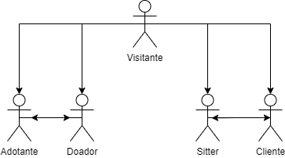

# Actors & User Stories

## Actors

  

| Identificador | Descrição |
| --- | --- |
| Visitante | Utilizador que acabou de entrar na aplicação e que pode se autenticar. |
| Adotante | Utilizador autenticado e que pode ir até a pagina de adoções e enviar a proposta de adoção de um animal. |
| Doador | Utilizador autenticado que pode colocar um animal para adoção e verificar quais propostas existem para o animal que colocou para adoção. |
| Sitter | Utilizador autenticado que oferece serviços de sitting de animais e pode especificar o seu pagamento e quais animais se sente confortável em cuidar. |
| Cliente | Utilizador autenticado que procura um sitter com quem deixar o seu animal de estimação. |
| Utilizador | Utilizador autenticado que pode ser qualquer um dos outros (tirando visitante) |

## User Stories

**Visitante**

| Identificador | Nome | Prioridade | Descrição |
| --- | --- | --- | --- |
| US01 | Autenticar | Alta | Como visitante quero poder-me autenticar na aplicação para poder entrar na mesma. |

**Adotante**

| Identificador | Nome | Prioridade | Descrição |
| --- | --- | --- | --- |
| US02 | Listagem | Alta | Como adotante quero poder ver uma lista dos animais disponíveis para poder ser candidato à sua adoção |
| US03 | Filtragem | Alta | Como adotante quero poder filtrar os animais para ir de encontro as minhas preferências. |

**Doador**

| Identificador | Nome | Prioridade | Descrição |
| --- | --- | --- | --- |
| US04 | Criar ficha de animal | Alta | Como doador quero poder criar uma ficha do animal para poder colocá-lo para adoção |
| US05 | Lista de candidatos | Alta | Como doador quero poder ver uma lista de candidatos a adoção do meu animal para poder decidir se concordo ou não |

**Sitter**

| Identificador | Nome | Prioridade | Descrição |
| --- | --- | --- | --- |
| US06 | Oferta | Alta | Como sitter quero poder ver uma lista de clientes para poder escolher um cujas exigências vão de encontro as minhas necessidades. |
| US07 | Segurança | Alta | Como sitter quero poder ver a ficha do animal para poder decidir se vai de encontro com as condições que ofereço |
| US08 | Remuneração | Alta | Como sitter quero poder trocar moeda digital por física para poder ser remunerado pelo meu serviço seguramente |
| US09 | filtragem | Alta | Como sitter quero poder filtrar pedidos por animais que vão de encontro com as minhas capacidades e limitações |

**Cliente**

| Identificador | Nome | Prioridade | Descrição |
| --- | --- | --- | --- |
| US10 | Procura | Alta | Como cliente quero colocar o pedido para sitters para ter propostas dos mesmos. |
| US11 | Lista | Alta | Como cliente quero ter acesso a uma lista de propostas de sitters para escolher o que vai ao encontro das minhas exigências. |
| US12 | Segurança | Alta | Como cliente quero ser cobrado pelo serviço apenas se a qualidade for assegurada para não me sentir injustiçado |
| US13 | Segurança animal | Media | Como cliente quero poder colocar um código QR na coleira do meu animal para que caso este se perca quem ler o código ter acesso ao meu contacto. |

Utilizador

| Identificador | Nome | Prioridade | Descrição |
| --- | --- | --- | --- |
| US14 | Perfil | Media | Como utilizador quero poder aceder a página de perfil e editar os dados ou a sua aparência para poder ter um maior controlo sobre a mesma. |
| US15 | Moedas | Alta | Como utilizador quero poder trocar dinheiro físico por digital para os pagamentos serem mais seguros e controlados pela aplicação. |
| US16 | Customização | Baixa | Como utilizador quero poder trocar moedas por customizações para o meu perfil. |
| US17 | Perfil animal | Alta | Como utilizador quero poder criar e editar o perfil do meu animal. |
| US18 | Documento animal | Alta | Como utilizador quero puder adicionar, remover e visualizar documentos do meu animal e do animal de outros. |
